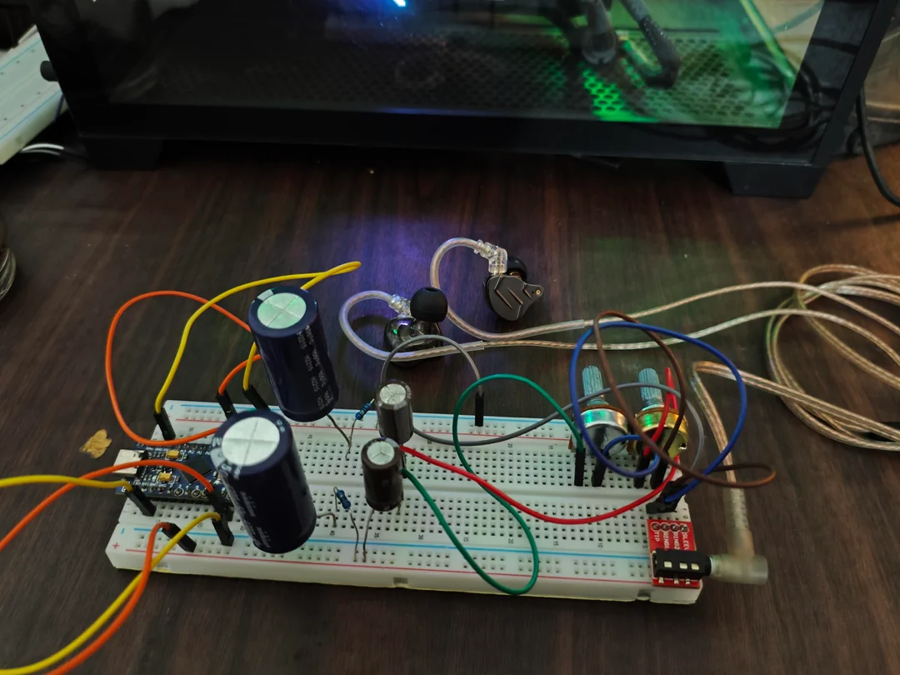
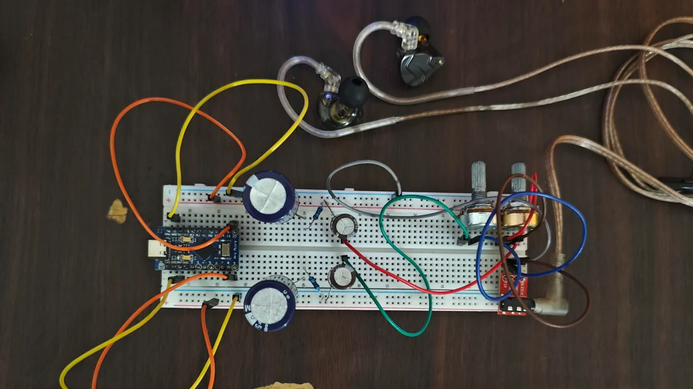

Please consider donating if you like this project, any amount would be appreciated.

[Kevin's Paypal](https://www.paypal.com/paypalme/vinrato)

# What
Dacuino allows you to turn your arduino into a USB-DAC that can play audio streamed from your PC/Laptop.

# How
Dacuino uses the **Timer1** and **Timer3** of 32u4.

**Timer1** is set to 8 bit Fast PWM and used to drive the duty cycle of OCR1A (pin 9) and OCR1B (pin 10) according to the stereo PCM data.
(OCR1A and OCR1B output the same PWM signal in mono mode.)

**Timer3** is set to 16 bit CTC interrupt mode and used to fetch the PCM sample and set Timer1 duty cycle x times a second (effectively setting the output sample rate.)

Dacuino is double buffered to reduce buffer overrun clicks, each buffer size is uint8_t * 1024.

PCM data is constantly fetched through serial communication from host PC with a software to decode audio files into raw PCM data.

# Why
For fun.

# Audio quality
The audio quality is severely limited by the ram size of the 32u4 (2.5KB), which limit how much PCM data we can buffer on the arduino, and the USB serial transfer speed.

Sample rates:

8 bit stereo: 38khz \
8 bit mono: 62khz

# Supported arduino devices
Only arduinos with 32u4 is supported for now. It should work with 328p too by modifying the timers, though it may yield lower sample rate.

# Schematics
I'm too lazy to make a schematic, so here are photos of the assembly. Should be easy enough to recreate. 
A low pass circuit is connected directly to each digital pin output of the MCU and then followed by a capacitor in series for blocking DC, and lastly, 
each channel goes through the two pots at the end and then straight to the headphones!

