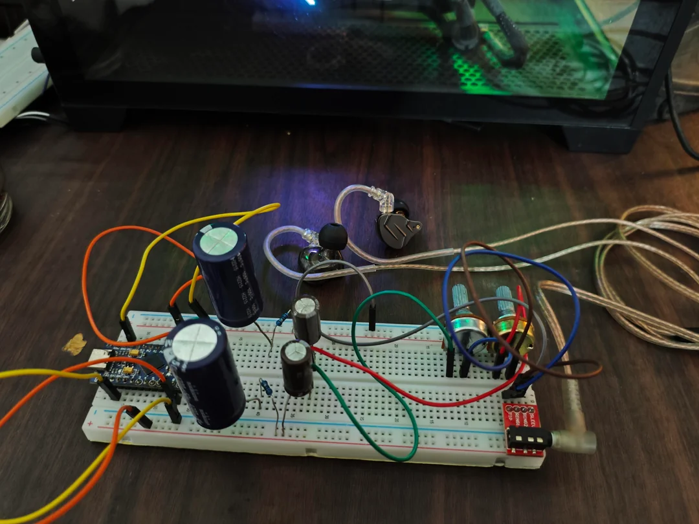
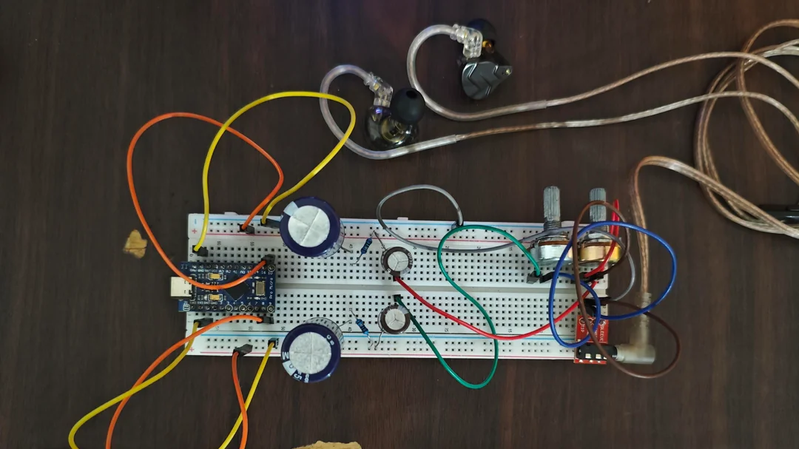

Please consider donating if you like this project, any amount would be appreciated.

[Kevin's Paypal](https://www.paypal.com/paypalme/vinrato)

# What
Dacuino is a project that turns your arduino into a piece of audio equipment called the DAC (Digital to Analog Converter).
Simply put, the sounds that we store in our computers, whether it's in a form of an mp3 files or any other formats, are being stored digitally because it's the only thing a computer can understand.
The job of the DAC is to convert those digital ones and zeroes into an analog voltage that we can use to drive the membranes inside our headphones back and forth to reproduce sound.
Nowadays, almost every modern computers, laptops, and phones have a built-in DAC.

# How
First we need to decode sound files (mp3, flac, wav, etc) and resample them into raw 8 bit PCM samples. Thankfully, we can use [BASS](https://www.un4seen.com/) to make this easy for us.
Once we have the PCM samples, we can then send it to our Arduino via serial communication. The samples are then buffered inside the Arduino so that we don't request data too often, as serial communication is very slow.
Dacuino is double buffered, which mean it has write buffer, and read buffer. Dacuino will first read the samples available in the read buffer. Once empty, the buffers will swap, read buffer now become write buffer, and write buffer become read buffer
so that we can fill the write buffer while the read buffer is still being read.

Dacuino utilizes the **Timer1** and **Timer3** of the Atmega 32U4 to generate PWM signals.

**Timer1** is set to 8 bit Fast PWM and used to drive the duty cycle of OCR1A (pin 9) and OCR1B (pin 10) according to the stereo PCM data.
(OCR1A and OCR1B output the same PWM signal in mono mode.)

**Timer3** is set to 16 bit CTC interrupt mode and used to fetch the PCM sample and set Timer1 duty cycle x times a second (effectively setting the output sample rate.)

# Why
Why not.

# Audio quality
The audio quality is severely limited by the memory size of the 32U4 (2.5KB), which limit how much PCM samples we can buffer inside the arduino. With a slightly bigger memory, we might be able to achieve standard sample rate (44.1khz).

Sample rates:

8 bit stereo: 38khz \
8 bit mono: 62khz

# Supported arduino devices
Only Arduino with 32U4 is supported for now. It should work with 328p too by modifying the timers, though it may yield lower sample rate.

# Schematics
I'm too lazy to make a schematic, so here are photos of the assembly. Should be easy enough to recreate. 
A low pass circuit is connected directly to each digital pin output of the MCU and then followed by a capacitor in series for blocking DC, and lastly, 
each channel goes through the two pots at the end and then straight to the headphones!

